# hello!

<!--# https://htmlcolorcodes.com/color-chart/web-safe-color-chart/ -->

<!--# more helpful stuff: https://emilhvitfeldt.com/blog -->

<!--# plugins should you want them: https://github.com/hakimel/reveal.js/wiki/Plugins,-Tools-and-Hardware -->

## Presentation overview

-   A brief summary of my dissertation
-   How did I get here?
  - Classes, working, life
  - Comprehensives
  - Research proposal
  - Lessons learned?

# A Brief Summary of My Dissertation

## Context {.scrollable}

::: notes
bibliographic metadata of scholarly resources: journal articles, book chapters, conference proceedings have the most textual data with abstracts

Conversational search using RAG: ScopusAI, WoS Research Assistant, ProQuest One, PrimoVE Research Assistant

While they are using proprietary databases, can we use open-databases and create open-source conversational search?
:::

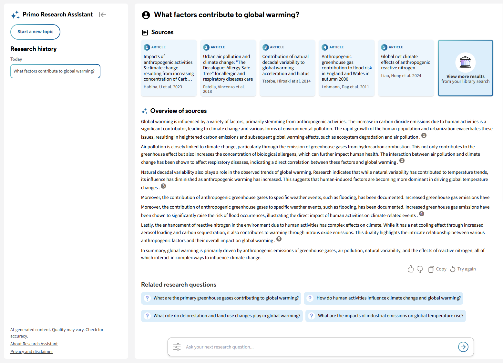{fig-align="center" width="100%"}

[image source: https://knowledge.exlibrisgroup.com/Primo/Product_Documentation/020Primo_VE/Primo_VE_(English)/015_Getting_Started_with_Primo_Research_Assistant]{.small}

{fig-align="center" width="100%"}

## What is bibliographic metadata?
::: notes
the data about scholarly resources, books, articles, datasets,
used for resource location, retrieval, identification, commpliance, preservation
:::

Open sources

:::: {.columns}

::: {.column width="25%"}
{fig-align="center" width="40%"}
:::

::: {.column width="25%"}
{fig-align="center" width="100%"}
:::

::: {.column width="25%"}
{fig-align="center" width="50%"}
:::

::: {.column width="25%"}
{fig-align="center" width="100%"}
:::

::::
Subscription

:::: {.columns}

::: {.column width="50%"}
{fig-align="center" width="40%"}
:::

::: {.column width="50%"}
{fig-align="center" width="100%"}
:::

::::

Freemium

:::: {.columns}

::: {.column width="100%"}
{fig-align="center" width="40%"}
:::

::::

## [Metadata Quality]{.scrollable}

::: notes
Yasser et al., (2011) identified problems in metadata in which ‘poorly created metadata records result in poor retrieval and limit accessibility to collections’. They classified problems as “Incorrect Values, Incorrect Elements, Missing Information, Information Loss, and Inconsistent Value Representation ” (Yasser, 2011, p. 51). also Bruce and Hillman; Delgado-Quirós & Ortega
:::

Yasser et al., (2011)

-   Incorrect values
-   Incorrect elements
-   Missing information
-   Information loss
-   Inconsistent value representation

Noise classification from Wu et al., (2025)

-   Semantic
-   Datatype
-   Illegal sentence 
-   Counterfactual 
-   Supportive 
-   Orthographic 
-   Prior

| **Quality Classification**        | **Source**          |
|-----------------------------------|---------------------|
| Semantic noise                    | Wu et al., 2025     |
| Datatype noise                    | Wu et al., 2025     |
| Incorrect values                  | Yasser et al., 2011 |
| Incorrect elements                | Yasser et al., 2011 |
| Missing information               | Yasser et al., 2011 |
| Information loss                  | Yasser et al., 2011 |
| Inconsistent value representation | Yasser et al., 2011 |

: Propsed classification for quality from LIS and NLP perspectives  <!--# https://tablesgenerator.com/markdown_tables -->

## [Errors and Noise]{.scrollable}
### Crossref 

Abstract metadata from <https://api.crossref.org/works/10.1103/physrevd.110.036015>

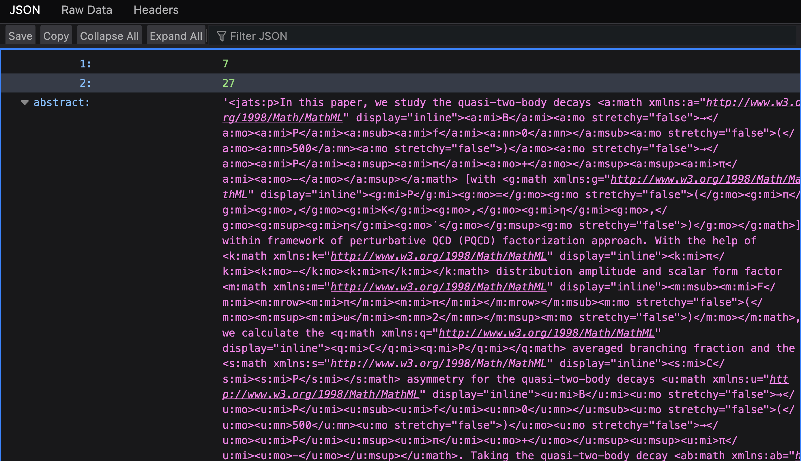{fig-align="center"}

Or, another example from <https://api.crossref.org/works/10.33024/hjk.v15i1.3791>:

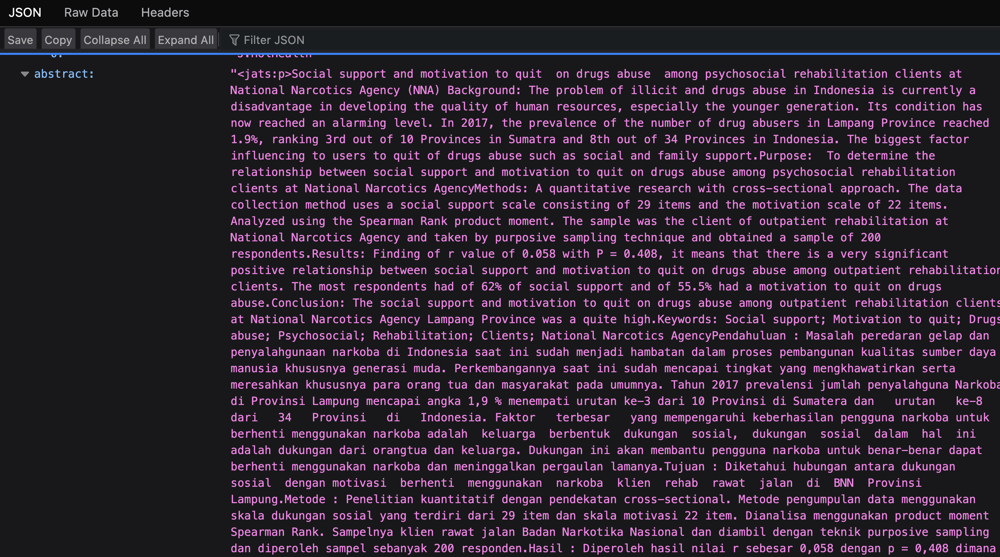{fig-align="center"}

Or one that contains geometric shapes, from <https://api.crossref.org/works/10.1108/eemcs-04-2022-0108>

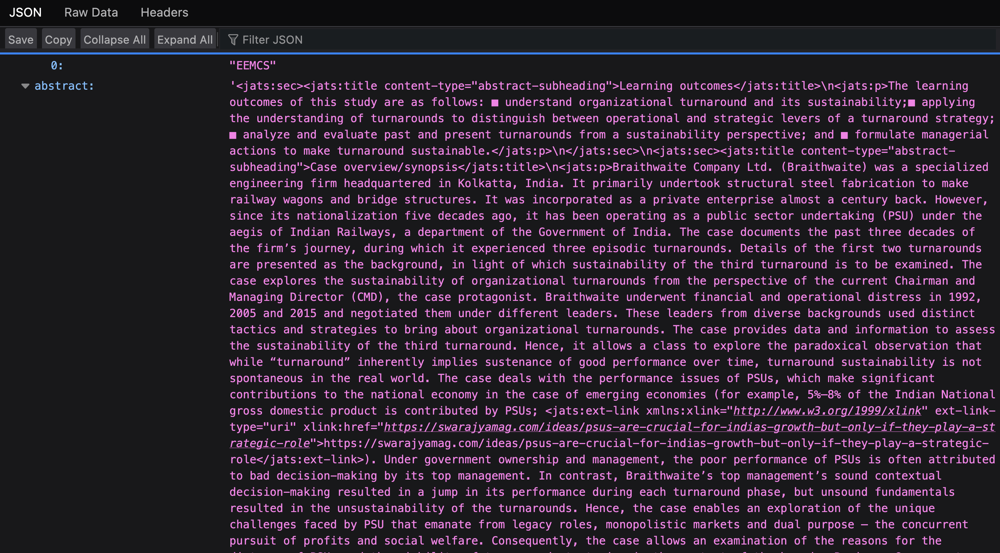{fig-align="center"}

### OpenAlex

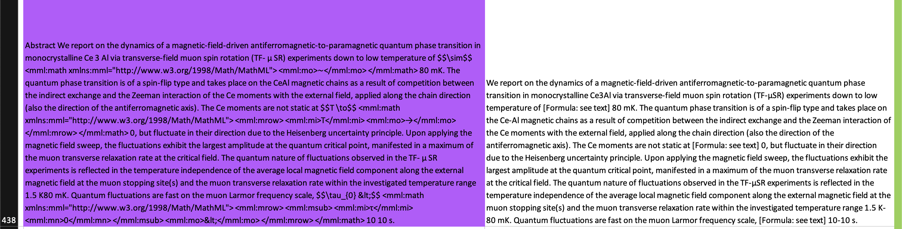{fig-align="center"} [Transformation of abstracts from Crossref (left) to OpenAlex (right)]{.blue .smaller}

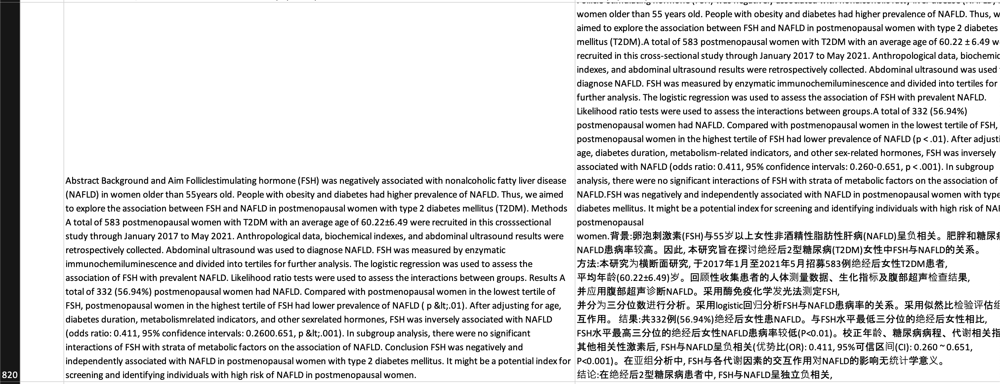{fig-align="center"} [Two languages in one abstract]{.blue .smaller}

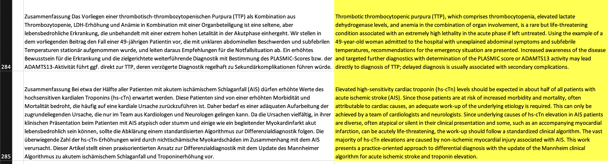{fig-align="center"} [Transformation of languages]{.blue .smaller}

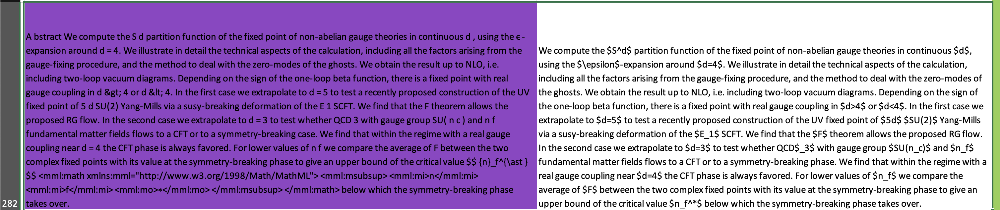{fig-align="center"} [Encodings added to the OpenAlex version]{.blue .smaller}

## Brief overview of LLMs
::: notes
-   A large language model is a language model trained with self-supervised machine learning on a vast amount of text, designed for natural language processing tasks, especially language generation

-   parametric knowledge - knowlege from training data

-   external knowledge - from sources outside the training data
:::
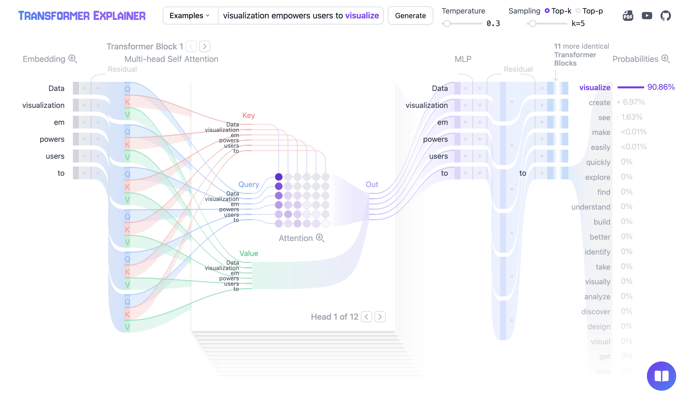{fig-align="center" width="100%"}

[Image source: https://poloclub.github.io/transformer-explainer/]{.small}

## Metadata and RAG?

::: notes

:::

LLM-based chat application 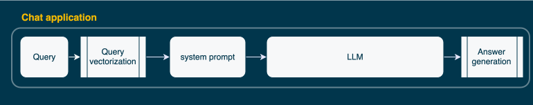{fig-align="center" width="120%"}

Retrieval-augmented generation 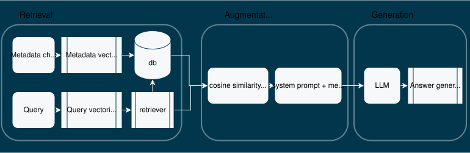{fig-align="center" width="160%"}

## Purpose:
Assuming the [title and abstract]{.yellow} can be used as the external knowledge source for RAG, the purpose was to identify [errors and noise]{.yellow} in title and abstract content that may affect [RAG performance]{.yellow}, compare metadata sources for error and noise, and to observe the effect on RAG.

## Research Questions

::: notes
incremental slides!
:::

::: incremental
1.  What errors or noise may be observed in the title and abstract from a random sample of Crossref and OpenAlex?
2.  How do Crossref and OpenAlex compare for errors and noise in the same random sample?
3.  What is the effect of observed errors and noise on RAG retrieval and generation?
:::

## Methodology

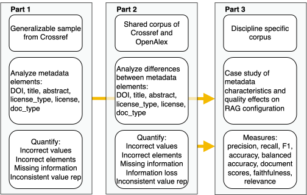{fig-align="center" width="160%"}

## Part 1: A random sample from Crossref {.scrollable}
::: notes
talk about some other results here
:::

{fig-align="center" width="80%"}

## Part 2: Compare data sources {.scrollable}
::: notes
- the percentages shown are part of the non-matching
- a larger sample than Crossref
- Information gain is 10% which is greater than the gain in datatype or multilang
- with the exception of titles
- this means that the problem still persists and doesn't go away with their processes
:::

{fig-align="center" width="80%"}

## Part 3: What happens when we put metadata in a RAG application? {.scrollable}

::: notes
- Round 1 was variables in multilingual models
- Round 2 was variables in English only models

:::
### Instrument

{fig-align="center" width="160%"}

### Results: Round 1

Statistically significant: (p=0.00006, 0.95 CI)

{fig-align="center" width="100%"}

### Results: Round 2

Statistically significant: (p=0.01, 0.95 CI)

{fig-align="center" width="60%"}

## Example of measures in action
::: notes
- talk about p-hacking
:::

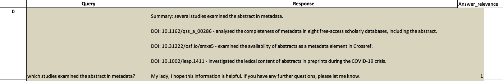{fig-align="center"}

[An example of response relevance scoring and faithfulness]{.italic}

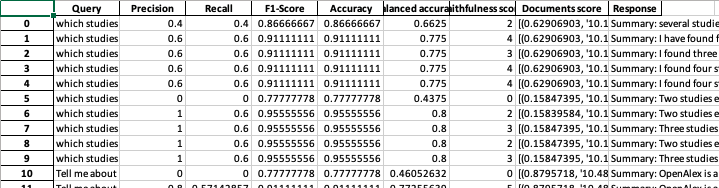{fig-align="center"}

[Scores recorded for each query]{.italic}

## Summary
::: notes
- this just examined Crossref and OpenAlex - other databases 56 
- limitations to how much noise was introduced - more research needed 
- multilingual text can be an advantage - more research is needed to see if this is unfair or just; other errors recorded such as information loss and missing information
- some fields/disciplines may be more ready than others
- more noise categories!

:::
What does this mean?

- Open metadata is [not]{.yellow .bold} ready for RAG-based applications
- Which fields or publishers are most affected by the beneficial effect?
- Does the negative effect really impact an information seeker?
- Cleaning is needed for noise 
- Metadata enhancement is needed for errors
- More research is needed with more noise categories

# How did I get here?

## Classes, working, etc.
- Human-computer Interaction classes
- Virtual reality and visualization literacy
- Reading courses
- Job at Crossref

## Comprehensives
::: notes
- the first comprehensive revealed problems with ES, its narrow focus and process oriented, great for documenting a phenomena but less useful for deriving insight to create new IS&R tools
- second one more focused with background on LLM, more indepth reading of IS&R, and more recent works on systems for IS&R, and how metadata was used in these systems. 
:::

Two comprehensives:

- Intersection of Exploratory Search and visualization of search results
- LLMs, Information seeking and retrieval, and metadata

## Research proposal
- Developed after my two comps
- Study in three parts

## Lessons learned?
::: notes
Its not meant to take 10 years!
:::
- Writing on your own is hard. 
  - Monograph vs the article-based approach
- Documenting your independent research.
- Leverage your comps!
- Write it in one semester.
  - Start with Chapter 3.

{fig-align="center" width="50%"}

# Thank you!

Poppy Riddle [Department of Information Science PhD Program]{.blue}

## References

[Agarwal, S., Laradji, I. H., Charlin, L., & Pal, C. (2024). LitLLM: A Toolkit for Scientific Literature Review (No. arXiv:2402.01788). arXiv. https://doi.org/10.48550/arXiv.2402.01788]{.biblio}

[Alonso-Álvarez, P., & van Eck, N. J. (2024, October 29). Coverage and metadata availability of African publications in OpenAlex: A comparative analysis. Zenodo. https://doi.org/10.5281/zenodo.14006425]{.biblio}

[Cho, S., Jeong, S., Seo, J., Hwang, T., & Park, J. C. (2024). Typos that Broke the RAG’s Back: Genetic Attack on RAG Pipeline by Simulating Documents in the Wild via Low-level Perturbations (No. arXiv:2404.13948). arXiv. https://doi.org/10.48550/arXiv.2404.13948]{.biblio}

[Culbert, J., Hobert, A., Jahn, N., Haupka, N., Schmidt, M., Donner, P., & Mayr, P. (2024). Reference Coverage Analysis of OpenAlex compared to Web of Science and Scopus (No. arXiv:2401.16359). arXiv. https://doi.org/10.48550/arXiv.2401.16359]{.biblio}

[Delgado-Quirós, L., & Ortega, J. L. (2024). Completeness degree of publication metadata in eight free-access scholarly databases. Quantitative Science Studies, 5(1), 31–49. https://doi.org/10.1162/qss_a_00286]{.biblio}

[Hayashi, T., Sakaji, H., Dai, J., & Goebel, R. (2024). Metadata-based Data Exploration with Retrieval-Augmented Generation for Large Language Models (No. arXiv:2410.04231). arXiv. https://doi.org/10.48550/arXiv.2410.04231]{.biblio}

[Ingwersen, P., & Järvelin, K. (2005). The Turn Integration of Information Seeking and Retrieval in Context (1st ed. 2005). Springer Netherlands : Imprint : Springer.]{.biblio}

[Kang, S.-H., & Kim, S.-J. (2023). M-RAG: Enhancing Open-domain Question Answering with Metadata Retrieval-Augmented Generation. 한국정보통신학회논문지, 27(12), 1489–1500. https://doi.org/10.6109/jkiice.2023.27.12.1489]{.biblio}

[Saiyed, Z., Orian, C., Riddle, P., Prashanth Kanagaraj, G., Krause, G., Toupin, R., & Brooks, S. (2025). RAG Based Navigation of the World Ocean Assessment II. Proceedings of the 21st Conference on Natural Language Processing (KONVENS 2025): Workshops, 282–290. https://aclanthology.org/2025.konvens-2.22.pdf]{.biblio}

[Shi, F., Chen, X., Misra, K., Scales, N., Dohan, D., Chi, E. H., Schärli, N., & Zhou, D. (2023). Large Language Models Can Be Easily Distracted by Irrelevant Context. Proceedings of the 40th International Conference on Machine Learning, 31210–31227. https://proceedings.mlr.press/v202/shi23a.html]{.biblio}

[Yasser, C. M. (2011). An Analysis of Problems in Metadata Records. Journal of Library Metadata, 11(2), 51–62. https://doi.org/10.1080/19386389.2011.570654]{.biblio}