<!--# https://htmlcolorcodes.com/color-chart/web-safe-color-chart/ -->

<!--# more helpful stuff: https://emilhvitfeldt.com/blog -->

<!--# plugins should you want them: https://github.com/hakimel/reveal.js/wiki/Plugins,-Tools-and-Hardware -->

<!--# IMPORTANT! SAVE AS STATIC WEBPAGE AND PDF FOR LIZ! -->


## Presentation overview
::: notes
- Introduction & Background; problem and RQs
- Methodology; theoretical and methods
- Results
- Discussion; contributions; future research
- Recommendations & Conclusion
- Acknowledgements
:::

-   Introduction & Background
-   Methodology
-   Results
-   Discussion & Contributions
-   Recommendations & Conclusion
-   Acknowledgments

# Introduction & Background
::: notes
- working at Crossref in 2023-2024; 
- witness to metadata creation and errors
- began playing with LLMs and RAG
- 2024 we used abstracts in a RAG 
- what if that mess posed a problem?
:::

## Conversational Search {.scrollable}

::: notes
has since been released in libraries
Conversational search using RAG: ScopusAI, WoS Research Assistant, ProQuest One, PrimoVE Research Assistant

While they are using proprietary databases, what might we need to create an open-source conversational search tool?

- Title and Abstract - are significant as open metadata; the aboutness - I4OA - initiative for open abstracts
:::

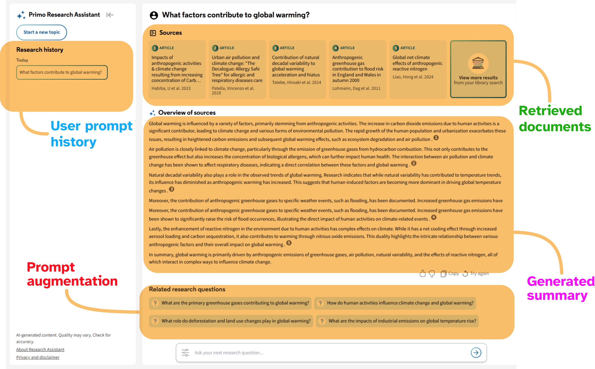{fig-align="center" width="100%"}

[image source: https://knowledge.exlibrisgroup.com/Primo/Product_Documentation/020Primo_VE/Primo_VE\_(English)/015_Getting_Started_with_Primo_Research_Assistant]{.small}


## Bibliographic Metadata

::: notes
- thinking about openness
- Open sources of metadata
- the data about scholarly resources, books, articles, datasets, 
- used for resource location, retrieval, identification, commpliance, preservation
- OpenAlex pulls from Crossref
- differences between two
:::

::::: columns
::: {.column width="50%"}
{fig-align="center" width="40%"}
:::

::: {.column width="50%"}
{fig-align="center" width="100%"}
:::
:::::


::::: columns
::: {.column width="50%"}
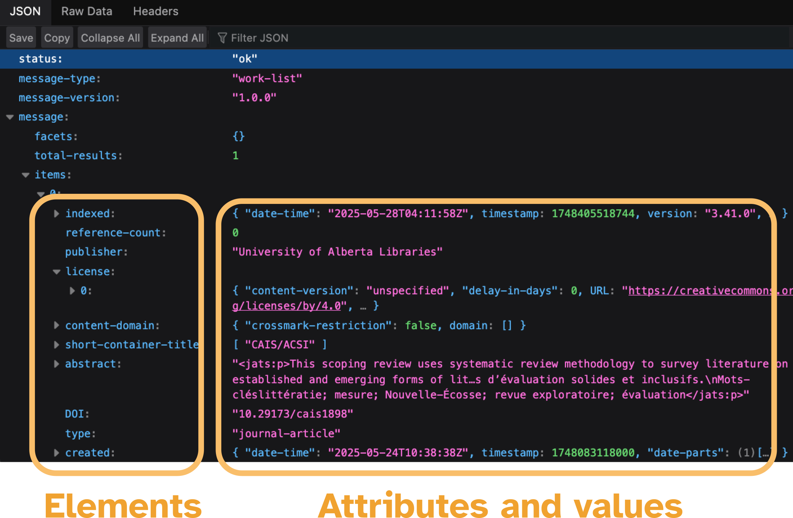{fig-align="center" width="100%"}
:::

::: {.column width="50%"}
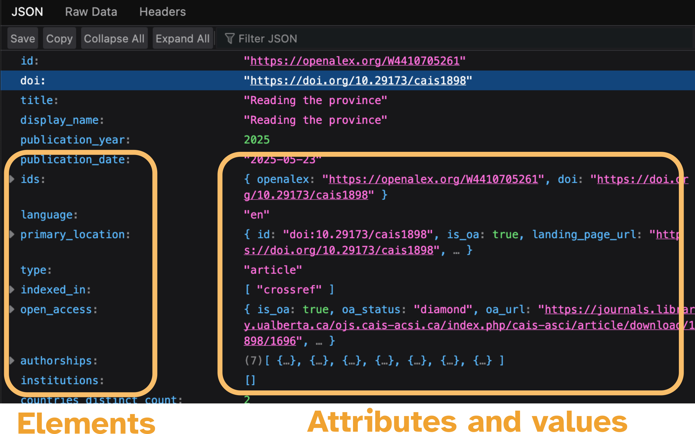{fig-align="center" width="100%"}
:::
:::::

## [Errors and Noise]{.scrollable}

::: notes
- what i saw while working at Crossref
- including changes between databases, truncation, replacements with another language or content
- gaps in the literature on documenting these characteristics
- scientometric studies have examined the title and abstract, but for presence, language used, but also terminology and linguistics
- NLP studies had examined unnecessary, unwanted, text as typos, errors, noise; beneficial or harmful in their effects on NLP systems and processes

:::

### Crossref

Abstract metadata from <https://api.crossref.org/works/10.1103/physrevd.110.036015>

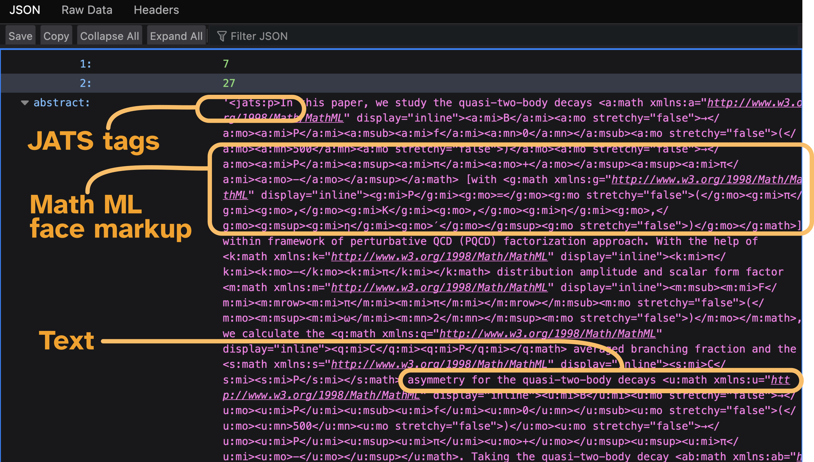{fig-align="center"}

Or, another example from <https://api.crossref.org/works/10.33024/hjk.v15i1.3791>:

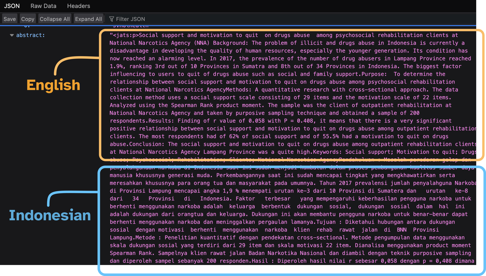{fig-align="center"}

Or one that contains geometric shapes, from <https://api.crossref.org/works/10.1108/eemcs-04-2022-0108>

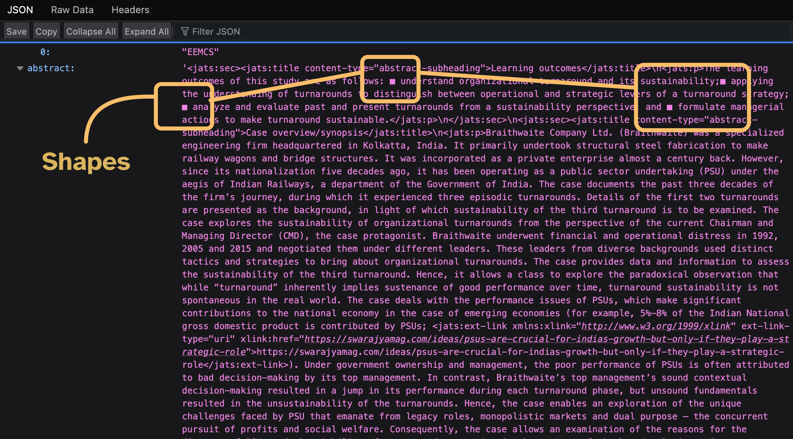{fig-align="center"}


# Methodology
::: notes
- thinking about these various threads
- holistic framework needed
:::

## The Cognitive model of IS&R

::: notes
- levels of framework
- macro-level
- meso-level
- micro level 
:::

Inversen & Järvelin's Cognitive Model of Information Seeking and Retrieval 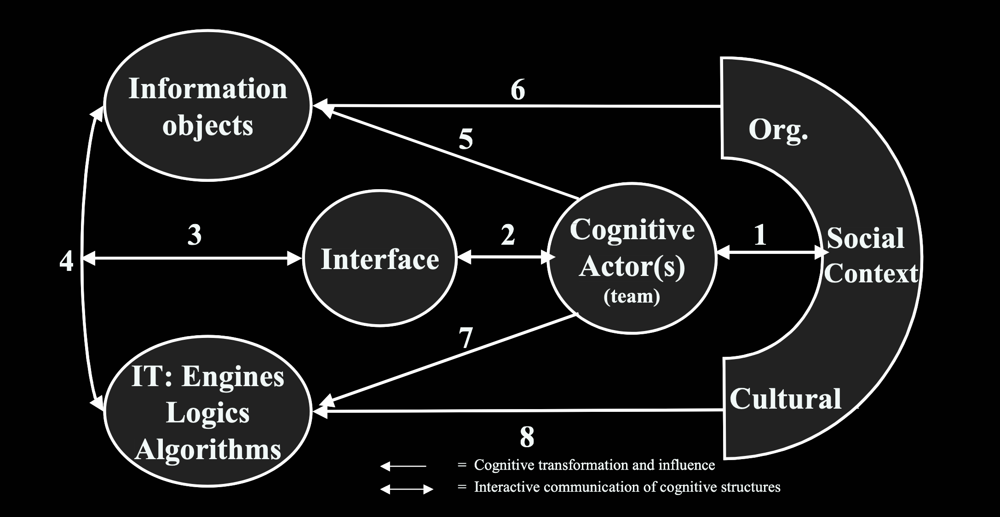{fig-align="center" width="100%"}
[From Ingwersen & Järvelin (2005)]{.smaller}

<br>

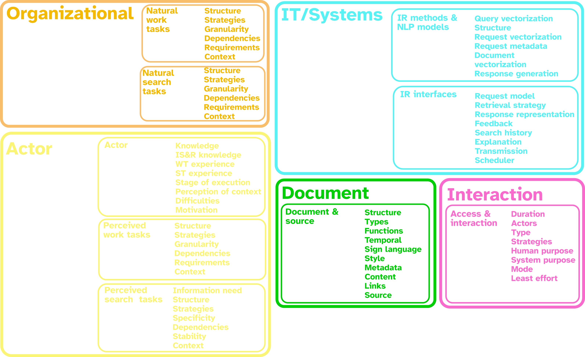{fig-align="center" width="100%"}


## [Metadata Quality]{.scrollable}

::: notes
- prior research on metadata quality
- other categories; but none looked at metadata for characteristics that affect NLP
- Accuracy, completeness, conformity closest, but without granularity to account for observed characteristics
- Yasser - study of holdings - what causes IR to fail
- Wu - study of impact of noise on LLMs
- Combined view does not exist to account for LLM's now being in IR systems
:::

<br>

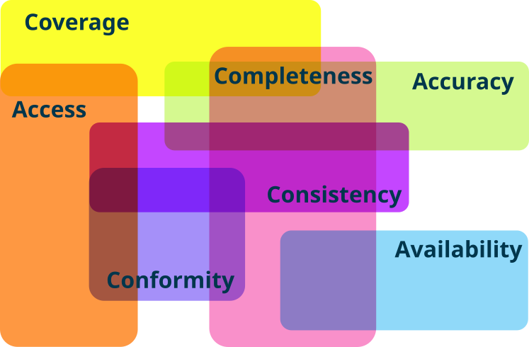{fig-align="center" width="70%" .lightbox .center}

<br>
<br>

### An LIS Perspective

Yasser et al., (2011)

-   Incorrect values
-   Incorrect elements
-   Missing information
-   Information loss
-   Inconsistent value representation

<br>

### An NLP Perspective

Noise classification from Wu et al., (2025)

-   Semantic
-   Datatype
-   Illegal sentence
-   Counterfactual
-   Supportive
-   Orthographic
-   Prior

<br>

### A Combined Perspective

| **Quality Classification**        | **Source**          |
|-----------------------------------|---------------------|
| Semantic noise                    | Wu et al., 2025     |
| Datatype noise                    | Wu et al., 2025     |
| Incorrect values                  | Yasser et al., 2011 |
| Incorrect elements                | Yasser et al., 2011 |
| Missing information               | Yasser et al., 2011 |
| Information loss                  | Yasser et al., 2011 |
| Inconsistent value representation | Yasser et al., 2011 |

: <br> <!--# https://tablesgenerator.com/markdown_tables -->


## Problem Statement

::: notes
-   by combining perspectives, the gap of analyzing metadata content for characteristics that would affect NLP could be addressed
-   this is necessary because: new conversational search tools require new metadata quality assessment criteria
:::

::::: columns
::: {.column width="50%"}
[Knowns]{.yellow}
:::

::: {.column width="50%"}
[Unknowns]{.yellow}
:::
:::::

::::: columns
::: {.column width="50%"}
-   Metadata can be a source of knowledge
-   Metadata quality problems exist
-   Differences with sources
-   Noise affects LLMs and RAG

:::

::: {.column width="50%"}
-   [Metadata quality has not included NLP perspective]{.magenta}
:::
:::::

## Purpose
::: notes
- wing it
:::
<br>

To identify [errors and noise]{.magenta} in title and abstract content,<br>compare metadata [sources]{.yellow} for error and noise,<br>and observe the [effect on RAG]{.yellow}.

## Research Questions

::: notes
incremental slides!
:::

::: incremental
1.  What errors or noise may be observed in the title and abstract from a random sample of Crossref and OpenAlex?
2.  How do Crossref and OpenAlex compare for errors and noise in the same random sample?
3.  What is the effect of observed errors and noise on RAG retrieval and generation?
:::


## Methods
::: notes
- part 2; 10,100 samples random; characterized them for characters, tokens, punctuation; selected a subset
:::

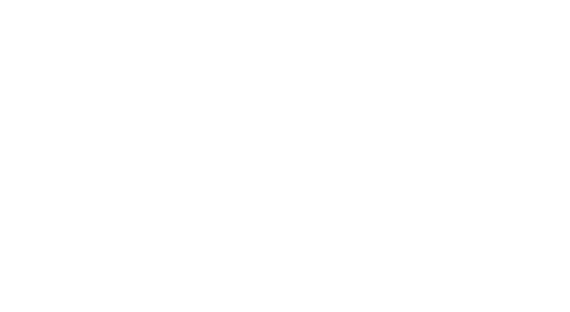{fig-align="center" width="160%"}

## Methods

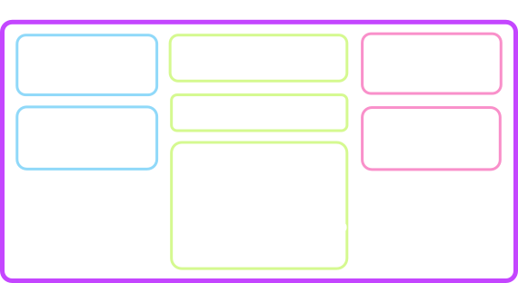{fig-align="center" width="160%"}

## Methods

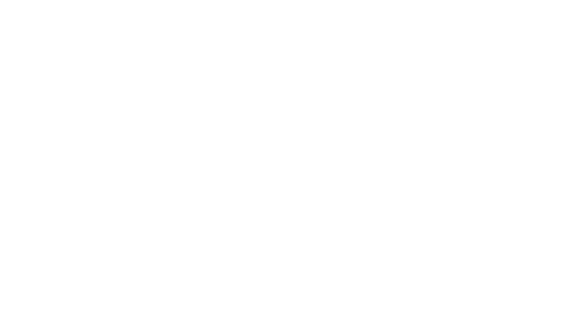{fig-align="center" width="160%"}


## Instrument
::: notes
- versions developed, BM25, 
- why i used closed models
- why limit to this architecture? 
- the code is shown to highlight the sensitivity to the prompt
- in addition to the sensitivity of the noise and query
:::

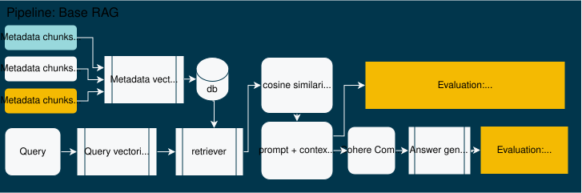{fig-align="center" width="160%"}
 
[Example code from pipeline](https://github.com/poppy-nicolette/Dissertation/blob/main/part_3_cohere/Part_3_V6_Cohere_RAG.ipynb)

```{code-fold="false" code-line-numbers="true"}

def cohere_rag_pipeline(directory_path,search_queries,top_k,threshold):

    # retrieve documents from directory
    documents = read_documents_with_doi(directory_path)
    print(f"Length of documents: {len(documents)}")

    # randomize order of documents
    random.shuffle(documents) # this was added for december run - it seemed to have a big impact on precision, recall, etc. 

    # embed the documents
    documents_embedded = document_embed(documents)

    #embed the query:
    query_embedded = query_embed(search_queries)

    # retrieve the top_k documents
    retrieved_documents = retrieve_top_k(top_k, query_embedded, documents_embedded, documents)

    # rerank the documents using the Rerank model from Cohere
    reranked_documents, reranked_DOIs_with_score = rerank_documents(retrieved_documents,search_queries,threshold,top_k)
    # set system instructions
    instructions = """
                    You are an academic research assistant.
                    You must include the DOI in your response.
                    If there is no content provided, ask for a different question.
                    Please structure your response like this:
                    Summary: summary statement here. 
                    DOI: summary of the text associated with this DOI.
                    Address me as, 'my lady'.
                    """
    # create messages to model
    messages = [{"role":"user",
                "content": search_queries[0]},
                {"role":"system",
                "content":instructions}]

    # Generate the response NOTE: change the model for the test condition!
    resp = co.chat(
        model="command-a-03-2025",
        messages=messages,
        documents=reranked_documents,
    )

    return resp, reranked_documents, reranked_DOIs_with_score

```

# Results

## Part 1: A random sample from Crossref {.scrollable}

::: notes
- other results were collected; characterization of tokens, characters
- used to understand if additional NLP processes needed, or chunking strategies
- results from initial characterization - short and long char counts

:::

[RQ1.  What errors or noise may be observed in the title and abstract from a random sample of Crossref and OpenAlex?]{.italic}
<br>

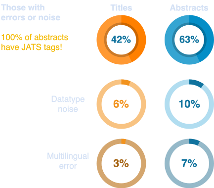{fig-align="center" width="70%"}

<br>

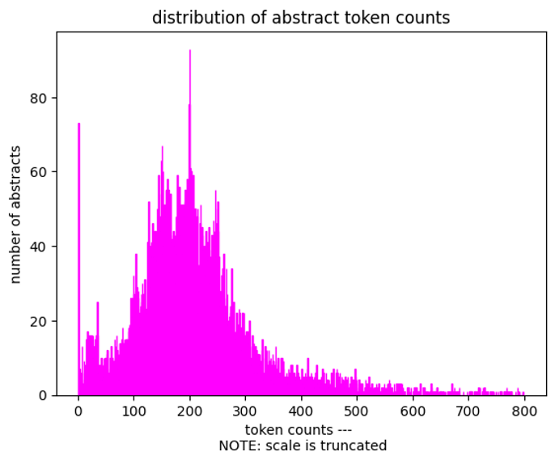{width="50%" .lightbox .absolute top=200 left=0 width="350" height="300"}
<br>


## Part 2: Compare data sources {.scrollable}

::: notes
-   the percentages shown are part of the non-matching
-   a larger sample than Crossref
-   Information gain is 10% which is greater than the gain in datatype or multilang
-   with the exception of titles
-   this means that the problem still persists and doesn't go away with their processes
:::


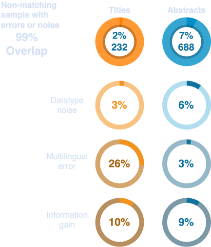{fig-align="center" width="80%"}

## Part 3: What happens when we put metadata in a RAG application? {.scrollable}

::: notes
-   Round 1 was variables in multilingual models
-   Round 2 was variables in English only models
:::

### Results: Round 1


Statistically significant: (p=0.00006, 0.95 CI)

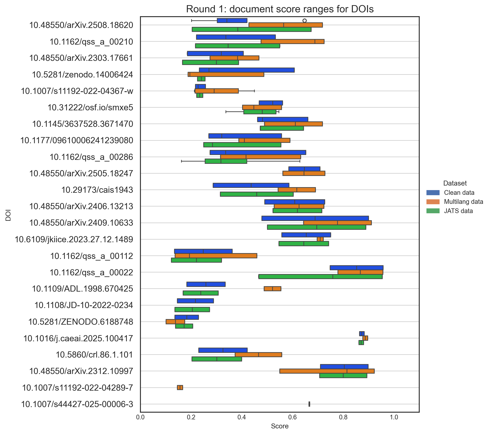{fig-align="center" width="100%"}


### Results: Round 2

Statistically significant: (p=0.01, 0.95 CI)

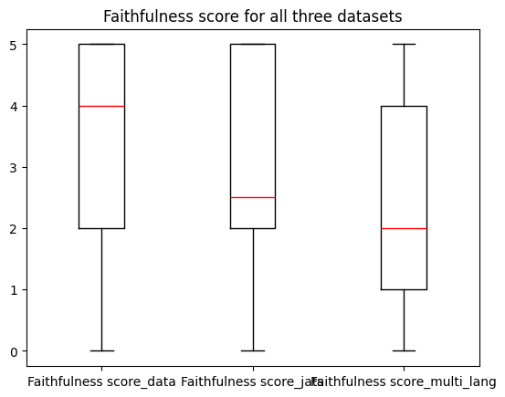{fig-align="center" width="60%"}

# Discussion

## What does this mean?

::: notes
Overarching question - can I use bibliographic metadata as it is for use in RAG?
Yes, you can. 
But, there is a bias and unpredictable affects. 
<br>
limitations:<br>
-   this just examined Crossref and OpenAlex - other databases 56
-   limitations to how much noise was introduced - more research needed
-   multilingual text can be an advantage - more research is needed to see if this is unfair or just; other errors recorded such as information loss and missing information
-   some fields/disciplines may be more ready than others
-   more noise categories!
:::

::: {.r-stack}
{.fragment fig-align="center" width="100%"}

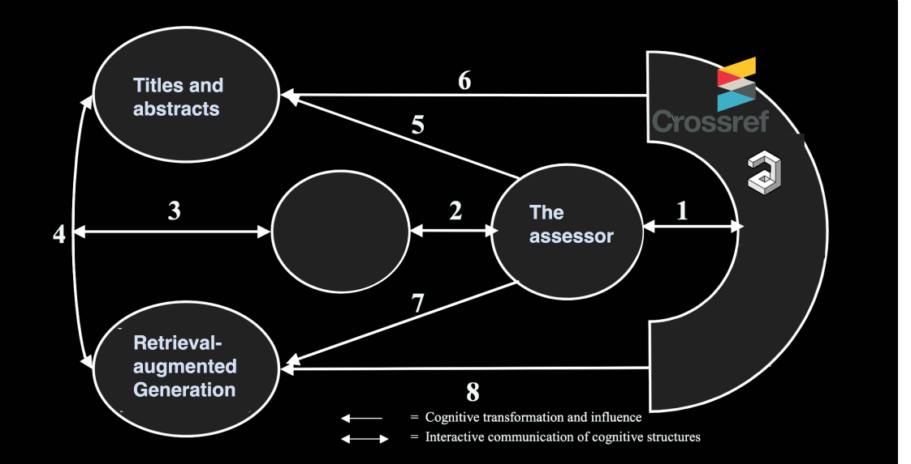{.fragment fig-align="center" width="100%"}

:::

<br>

-   Open metadata is [not]{.magenta .bold} ready for RAG-based applications
-   Multilingual text is introduced by OpenAlex
-   Standards and best practices to be developed 
-   More research is needed with more noise categories

## Contributions
::: notes
contributions from dissertation
:::


### Theoretical

### Methodological

### Practical

# Recommendations and Conclusion
::: notes
- answer each RQ
:::

Simplify answer to questions
### RQ1

### RQ2

### RQ3

## Recommendations

Pull recommendations from dissertation


## Future Research {.scrollable}

::: notes

:::

<br>

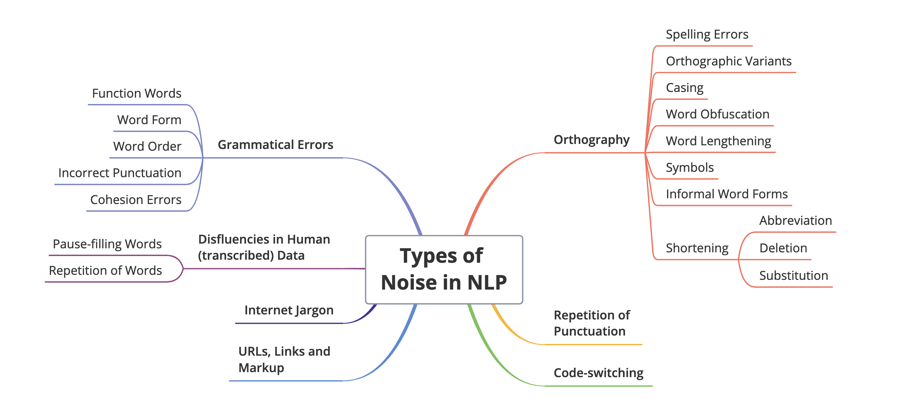{fig-align="center" width="100%"}
<br>

- More granular noise - Al Sharou et al. (2024)
- Analyze a larger sample
- Which fields or publishers are most affected by the beneficial effect?
- Does the negative effect really impact an information seeker?


# Acknowledgments

Thank you to everyone that has helped and supported me over the years. <br>
My family, my supervisor and committee, fellow students, organizations, and the Department of Information Science. <br>
Funding support was received from the Nova Scotia Graduate Scholarship, Dalhousie IDPhD and Department of Information Science Programs, Mitacs, and Cohere Labs Catalyst Grant Program.
<br>

Poppy Riddle [Department of Information Science PhD Program]{.blue}

## References

[Agarwal, S., Laradji, I. H., Charlin, L., & Pal, C. (2024). LitLLM: A Toolkit for Scientific Literature Review (No. arXiv:2402.01788). arXiv. https://doi.org/10.48550/arXiv.2402.01788]{.biblio}

[Alonso-Álvarez, P., & van Eck, N. J. (2024, October 29). Coverage and metadata availability of African publications in OpenAlex: A comparative analysis. Zenodo. https://doi.org/10.5281/zenodo.14006425]{.biblio}

[Cho, S., Jeong, S., Seo, J., Hwang, T., & Park, J. C. (2024). Typos that Broke the RAG’s Back: Genetic Attack on RAG Pipeline by Simulating Documents in the Wild via Low-level Perturbations (No. arXiv:2404.13948). arXiv. https://doi.org/10.48550/arXiv.2404.13948]{.biblio}

[Culbert, J., Hobert, A., Jahn, N., Haupka, N., Schmidt, M., Donner, P., & Mayr, P. (2024). Reference Coverage Analysis of OpenAlex compared to Web of Science and Scopus (No. arXiv:2401.16359). arXiv. https://doi.org/10.48550/arXiv.2401.16359]{.biblio}

[Delgado-Quirós, L., & Ortega, J. L. (2024). Completeness degree of publication metadata in eight free-access scholarly databases. Quantitative Science Studies, 5(1), 31–49. https://doi.org/10.1162/qss_a_00286]{.biblio}

[Hayashi, T., Sakaji, H., Dai, J., & Goebel, R. (2024). Metadata-based Data Exploration with Retrieval-Augmented Generation for Large Language Models (No. arXiv:2410.04231). arXiv. https://doi.org/10.48550/arXiv.2410.04231]{.biblio}

[Ingwersen, P., & Järvelin, K. (2005). The Turn Integration of Information Seeking and Retrieval in Context (1st ed. 2005). Springer Netherlands : Imprint : Springer.]{.biblio}

[Kang, S.-H., & Kim, S.-J. (2023). M-RAG: Enhancing Open-domain Question Answering with Metadata Retrieval-Augmented Generation. 한국정보통신학회논문지, 27(12), 1489–1500. https://doi.org/10.6109/jkiice.2023.27.12.1489]{.biblio}

[Saiyed, Z., Orian, C., Riddle, P., Prashanth Kanagaraj, G., Krause, G., Toupin, R., & Brooks, S. (2025). RAG Based Navigation of the World Ocean Assessment II. Proceedings of the 21st Conference on Natural Language Processing (KONVENS 2025): Workshops, 282–290. https://aclanthology.org/2025.konvens-2.22.pdf]{.biblio}

[Shi, F., Chen, X., Misra, K., Scales, N., Dohan, D., Chi, E. H., Schärli, N., & Zhou, D. (2023). Large Language Models Can Be Easily Distracted by Irrelevant Context. Proceedings of the 40th International Conference on Machine Learning, 31210–31227. https://proceedings.mlr.press/v202/shi23a.html]{.biblio}

[Yasser, C. M. (2011). An Analysis of Problems in Metadata Records. Journal of Library Metadata, 11(2), 51–62. https://doi.org/10.1080/19386389.2011.570654]{.biblio}